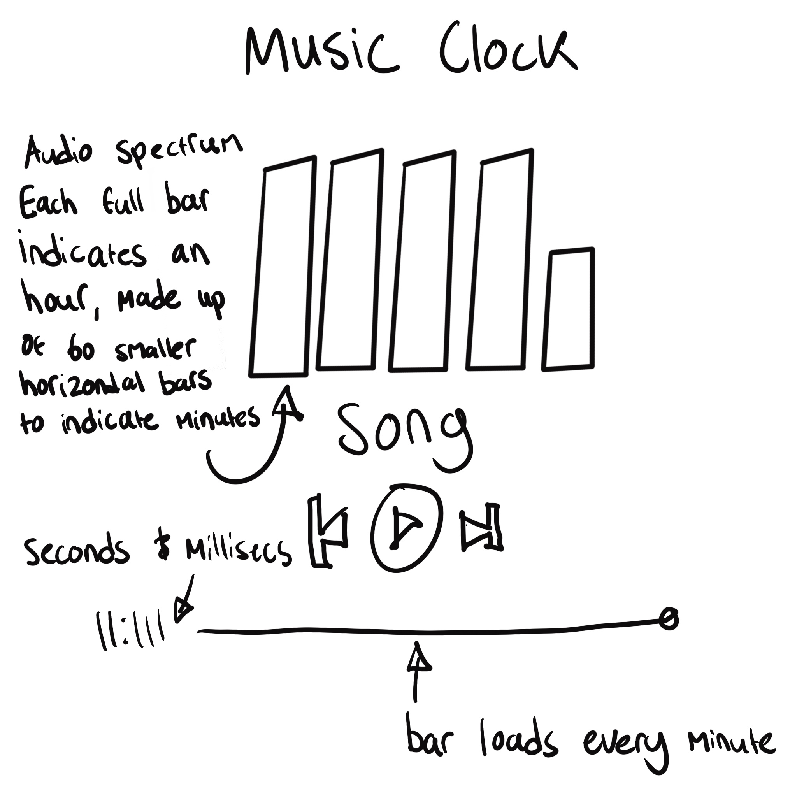

## MDDN 242 Project 1: Time-based Media  

### THIS IS YOUR README

Update this file as you go along to record your progress.

# READ ME FOR PROJECT CLOCK 1

# ISAIAH WARBRICK, 300583545

## BASE SKETCH FOR FINAL PROJECT

29/02/24:
 - Updated sketch.jpg with initial idea

 .JPG>)

 This idea was based off some test tubes I found in my room. I thought of the idea of a water clock and come up with this when thinking of how a row of test tubes could be used to measure time. I don't plan to make them look exactly like test tubes as reducing the amount of detail I implement would make my workload lighter
 
 NOTE: This idea changed at a later date a the 7th of match. Above base sketch is what I made later after scrapping my original idea. It is fairly similar though.

5/03/24
Began coding final clock project
Started with setting background colour and doing the "tubes"
Began maeda clock, basing it off clock number 6

6/03/24
Finished maeda clock to a minimal accepted standard, will slightly improve slowly until final submission

7/03/24
Huge progress with clock assignment:
- Pivoted off original idea and am now going with an audio spectrum type of clock
- Choreographed minutes with horizontal bars
- Thus, choreographed vertical bars to each hour
- Added seconds into the corner, therefore covering all minimum requirements
- Slightly stylized i.e digital font

Looking for more visual improvements and will share with Pheobe to get feedback on anything I may have missed or could be used to improve my work

- Made some colour adjustments
- Added a slight gradient that flashes in accordance to the milliseconds, adding a new indicator for time as per the brief
- Looking to incorporate a digital stereo audio equalizer sort of aesthetic

12/03/24 

- Incorporated alarm function, needs improvement

- Also finished Maeda clock, not functional but visually near what the original was. The grey squares are duller and I tightened the are in which the grey squares appear

19/03/24

- Rehauled visuals and implemented song bar as well as some other visual elements to indicate the audio player aesthetic

20/03/24

- Finished alarm function to say wake up when it is activated

# FINAL PROJECT WRITE UP:

I decided to go with the name "Stereo Clock". I pivoted off my original test tube idea after realizing that liquid was to difficult to code and ended up looking more like a loading bar. I was using the vertical process of the bar to indicate minutes but realized that was too difficult to indicate without using an external number. Instead, I built these vertical bars out of horizontal bars and made 60 of them which indicated minutes better. I removed the external minute counter to create a more abstract clock feeling. I changed the colors of the bars to a gradient reminiscent of a miami nights/vaporwave aesthetic. From here I decided to embrace this and added some more visual elements slightly based off any music playing app like spotify.

The only non functional visual elements here is the play, skip forward and skip backward buttons.

As I already wrote the vertical bars indicate the amount of hours that have passed
The next bar that is incomplete is indicating the current minutes by counting the amount of horizontal bars there are
The numbers at the bottom left is the amount of seconds and milliseconds there are in the current minute. Which doubles as looking like the amount of time left in a song
And finally the song bar at the bottom actually loads for every minute, giving a more visual representation to the numbers next to it.

I wish I would've added a minute counter to the right of the song bar to make the song bar to help make the time reading more accurate. However this might have taken away from my horizontal bars concept. I think I definitely needed a way to tell between the AM and PM though.

